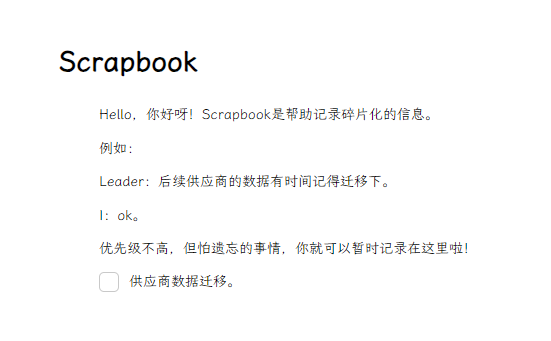

# Scrapbook

## Thanks

1. [codex-team/editor.js](https://github.com/codex-team/editor.js)
2. [lxgw/LxgwWenKai](https://github.com/lxgw/LxgwWenKai)
3. [tauri-apps/tauri](https://github.com/tauri-apps/tauri)

## Introduction

Scrapbook helps to record fragmented information.



## Dev

Run app: 

```shell
tauri dev
```

### Editor Block Event

```text
model BlockAddedEvent {
  action_type: 'block-added';
  index: number;
}

model BlockRemovedEvent {
  action_type: 'block-removed';
  index: number;
}

model BlockMovedEvent {
  action_type: 'block-moved';
  fromIndex: number;
  toIndex: number;
}

model BlockChangedEvent {
  action_type: 'block-changed';
  index: number;
}
```

### Editor Block Data

```text
model BlockData<T> {
    id: string;
    tool: string;
    data: T;
}
```